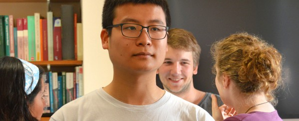

I am a first year PhD student in Statistics at the Oxford-Warwick Statistics Programme.

{::comment}
## Research Interests
## Teaching
## Publications
## Talks
## Software
## Other Interests
{:/comment}

## Education

**PhD** in Statistics *(2014- )*
: OxWaSP CDT in Next Generational Statistical Science
Department of Statistics, University of Warwick

**BSc MMathStat** in Mathematics and Statistics *(2010-2014)*
: Department of Statistics, University of Warwick

*[PhD]: Doctor of Philosophy
*[OxWaSP]: Oxford-Warwick Statistics Programme
*[CDT]: Centre for Doctoral Training
*[BSc MMathStat]: Bachelors of Science and Masters of Mathematics and Statistics

## Links
* [Academic Homepage](http://www.stats.ox.ac.uk/~sjin/)
* [Personal Blog](https://tomj.in)
* [GitHub](https://github.com/tom-jin)

## Contact

Email
: <suchen.jin@stats.ox.ac.uk>

Post
: Tom Jin  
St. Peter's College  
New Inn Hall Street  
Oxford  
OX1 2DL  

Location
: Room 307  
2 South Parks Road  
Department of Statistics  
University of Oxford

